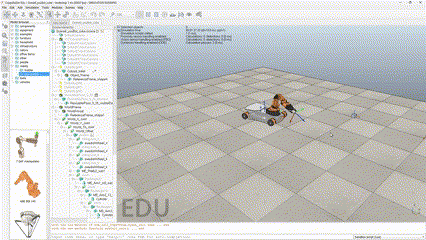

# Mobile Manipulation Capstone

This project is my implementation of the [Mobile Manipulation Capstone](https://hades.mech.northwestern.edu/index.php/Mobile_Manipulation_Capstone) from the Modern Robotics course by Northwestern University. The task involves commanding a mobile manipulator to pick up a cube from an initial location and place it at a final location using coordinated motion across its base, arm, and gripper.

# Simulation

